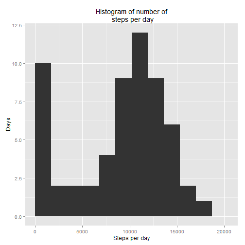
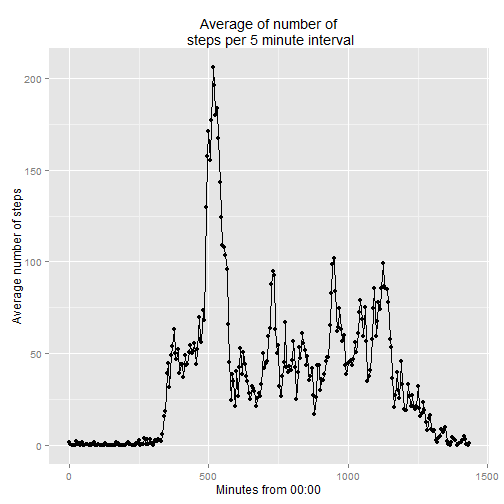
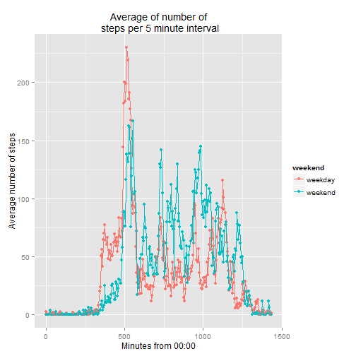

Assignment 1. Activity Monitoring Data
======================================

###Loading and preprocessing the data

1. Firstly, let's read csv file from the web:

```r
#Loading library
library(plyr)
library(ggplot2)
library(gridExtra)
```


```r
#Creating temporary file in memory
temp <- tempfile()
#Just to use download.file in R Markdown
setInternet2(use = TRUE)
#Download zip file in temp
download.file("https://d396qusza40orc.cloudfront.net/repdata%2Fdata%2Factivity.zip", temp)
#Unzip temp file and read "activity.csv" from it to activity variable
activity <- read.csv(unz(temp, "activity.csv"))
#Delete temp file
unlink(temp)
```

2. Explore size of data.frame:

```r
dim(activity)
```

```
[1] 17568     3
```

3. Explore type of variables in **activity** data.frame:

```r
str(activity)
```

```
'data.frame':	17568 obs. of  3 variables:
 $ steps   : int  NA NA NA NA NA NA NA NA NA NA ...
 $ date    : Factor w/ 61 levels "2012-10-01","2012-10-02",..: 1 1 1 1 1 1 1 1 1 1 ...
 $ interval: int  0 5 10 15 20 25 30 35 40 45 ...
```
So, **steps** variable is correct type. It is better to change type of **date** to some date type. **interval** variable represents minutes interval. It is better to transform this column to two columns, one of which will represent start hour, second - start minute.


```r
#Tranforming date variable to Date type
activity$date <- as.Date(activity$date)

#Adding two variables based on interval variable
activity$interval <- as.character(activity$interval)
activity$interval <- sapply(activity$interval, FUN = function(element) return(paste(as.character(c(rep(0, (4-nchar(element))), element)), collapse = "")))

activity$start_hour <- as.integer(sapply(activity$interval, FUN = function (element) return (substr(element, 1, 2))))
activity$start_minute <- as.integer(sapply(activity$interval, FUN = function (element) return (substr(element, 3, 4))))
```

Now, data looks like:

```r
head(activity)
```

```
  steps       date interval start_hour start_minute
1    NA 2012-10-01     0000          0            0
2    NA 2012-10-01     0005          0            5
3    NA 2012-10-01     0010          0           10
4    NA 2012-10-01     0015          0           15
5    NA 2012-10-01     0020          0           20
6    NA 2012-10-01     0025          0           25
```

And type of variables:

```r
str(activity)
```

```
'data.frame':	17568 obs. of  5 variables:
 $ steps       : int  NA NA NA NA NA NA NA NA NA NA ...
 $ date        : Date, format: "2012-10-01" "2012-10-01" ...
 $ interval    : chr  "0000" "0005" "0010" "0015" ...
 $ start_hour  : int  0 0 0 0 0 0 0 0 0 0 ...
 $ start_minute: int  0 5 10 15 20 25 30 35 40 45 ...
```

***

###What is mean total number of steps taken per day?

1. Total number of steps per day:

```r
total_steps <- ddply(activity, ~date, summarise, Total_steps=sum(steps, na.rm = TRUE))
total_steps
```

```
         date Total_steps
1  2012-10-01           0
2  2012-10-02         126
3  2012-10-03       11352
4  2012-10-04       12116
5  2012-10-05       13294
6  2012-10-06       15420
7  2012-10-07       11015
8  2012-10-08           0
9  2012-10-09       12811
10 2012-10-10        9900
11 2012-10-11       10304
12 2012-10-12       17382
13 2012-10-13       12426
14 2012-10-14       15098
15 2012-10-15       10139
16 2012-10-16       15084
17 2012-10-17       13452
18 2012-10-18       10056
19 2012-10-19       11829
20 2012-10-20       10395
21 2012-10-21        8821
22 2012-10-22       13460
23 2012-10-23        8918
24 2012-10-24        8355
25 2012-10-25        2492
26 2012-10-26        6778
27 2012-10-27       10119
28 2012-10-28       11458
29 2012-10-29        5018
30 2012-10-30        9819
31 2012-10-31       15414
32 2012-11-01           0
33 2012-11-02       10600
34 2012-11-03       10571
35 2012-11-04           0
36 2012-11-05       10439
37 2012-11-06        8334
38 2012-11-07       12883
39 2012-11-08        3219
40 2012-11-09           0
41 2012-11-10           0
42 2012-11-11       12608
43 2012-11-12       10765
44 2012-11-13        7336
45 2012-11-14           0
46 2012-11-15          41
47 2012-11-16        5441
48 2012-11-17       14339
49 2012-11-18       15110
50 2012-11-19        8841
51 2012-11-20        4472
52 2012-11-21       12787
53 2012-11-22       20427
54 2012-11-23       21194
55 2012-11-24       14478
56 2012-11-25       11834
57 2012-11-26       11162
58 2012-11-27       13646
59 2012-11-28       10183
60 2012-11-29        7047
61 2012-11-30           0
```

2. Histogram of total number of steps:

```r
rng <- range(total_steps$Total_steps)
p1 <- qplot(Total_steps, 
      data=total_steps,
      geom="histogram", 
      breaks = seq(rng[1], rng[2], by =1700),
      main = "Histogram of number of\n steps per day",
      xlab = "Steps per day",
      ylab = "Days"
      )
p1
```

 

3. Mean and median of the total number of steps taken per day:

```r
#Mean number of total number of steps per day
mean(total_steps$Total_steps, na.rm = TRUE)
```

```
[1] 9354.23
```

```r
#Median number of total number of steps per day
median(total_steps$Total_steps, na.rm = TRUE)
```

```
[1] 10395
```

***
###What is the average daily activity pattern?

1. Average number of steps per 5 minute interval:

```r
activity$minute_from_00 <- activity$start_hour * 60 + activity$start_minute
avr_steps_5min <- ddply(activity, ~minute_from_00, summarise, Avr_steps=mean(steps, na.rm = TRUE))
head(avr_steps_5min)
```

```
  minute_from_00 Avr_steps
1              0 1.7169811
2              5 0.3396226
3             10 0.1320755
4             15 0.1509434
5             20 0.0754717
6             25 2.0943396
```

2. Plotting average values per 5 minutes:

```r
p2 <- qplot(minute_from_00,
      Avr_steps,
      data=avr_steps_5min,
      geom=c("point", "path"),
      main = "Average of number of\n steps per 5 minute interval",
      xlab = "Minutes from 00:00",
      ylab = "Average number of steps"
      )
p2
```

 

3. 5 minutes interval with max number of average steps:

```r
avr_steps_5min[which.max(avr_steps_5min$Avr_steps),]
```

```
    minute_from_00 Avr_steps
104            515  206.1698
```
So, max number of steps at average is taken place from 08:35 to 08:40.

***

###Imputing missing values

1. Total number of missing values in the dataset:

```r
#Number of NAs in activity data.frame
apply(activity[,1:3], 2, FUN = function(column) return(sum(is.na(column))))
```

```
   steps     date interval 
    2304        0        0 
```
So, there are 2304 NAs in **steps** column and no NAs in **date** and **interval** columns.

2. Replacing NAs in **steps** column with average number of steps per 5 minute interval:

```r
activity_noNA <- activity

for (i in 1:nrow(activity_noNA)) {
        if (is.na(activity_noNA$steps[i])) {
                activity_noNA$steps[i] <- avr_steps_5min$Avr_steps[avr_steps_5min$minute_from_00 == activity_noNA$minute_from_00[i]]
        }
} 

#Number of NAs in activity_noNA data.frame
apply(activity_noNA[,1:3], 2, FUN = function(column) return(sum(is.na(column))))
```

```
   steps     date interval 
       0        0        0 
```
There are no NAs left.

Head of the data now looks like:

```r
head(activity_noNA)
```

```
      steps       date interval start_hour start_minute minute_from_00
1 1.7169811 2012-10-01     0000          0            0              0
2 0.3396226 2012-10-01     0005          0            5              5
3 0.1320755 2012-10-01     0010          0           10             10
4 0.1509434 2012-10-01     0015          0           15             15
5 0.0754717 2012-10-01     0020          0           20             20
6 2.0943396 2012-10-01     0025          0           25             25
```

3. Total number of steps taken each day, calculated based on data with imputed NA:

```r
total_steps_noNA <- ddply(activity_noNA, ~date, summarise, Total_steps=sum(steps, na.rm = TRUE))
head(total_steps_noNA)
```

```
        date Total_steps
1 2012-10-01    10766.19
2 2012-10-02      126.00
3 2012-10-03    11352.00
4 2012-10-04    12116.00
5 2012-10-05    13294.00
6 2012-10-06    15420.00
```

Two histogram of total number of steps without and with imputed NAs:

```r
rng <- range(total_steps_noNA$Total_steps)
p3 <- qplot(Total_steps, 
      data=total_steps_noNA,
      geom="histogram", 
      breaks = seq(rng[1], rng[2], by =1700),
      main = "Histogram of number of\n steps per day with imputed NA",
      xlab = "Steps per day",
      ylab = "Days")
grid.arrange(p1, p3, ncol=2)
```

 

4. Mean and median of the total number of steps taken per day without and with imputed NAs:

```r
#Mean number of total number of steps per day
mean(total_steps$Total_steps, na.rm = TRUE)
```

```
[1] 9354.23
```

```r
mean(total_steps_noNA$Total_steps)
```

```
[1] 10766.19
```

```r
#Median number of total number of steps per day
median(total_steps$Total_steps, na.rm = TRUE)
```

```
[1] 10395
```

```r
median(total_steps_noNA$Total_steps)
```

```
[1] 10766.19
```

Imputing has next impact:  
1. Histogram changed its view a little bit. Now, there are no days with no steps, but more days with ~11000 steps. It as because we changed total number of steps for 8 days;  
2. Mean and Medium values of steps became the same -> distribution became more normal.

***

###Are there differences in activity patterns between weekdays and weekends?

1. Creating a new factor variable with weekday and more for identifying weekend:

```r
Sys.setlocale("LC_TIME", "English")
```

```
[1] "English_United States.1252"
```


```r
activity_noNA$weekday <- factor(weekdays(activity_noNA$date))
activity_noNA$weekend <- factor(ifelse((activity_noNA$weekday == "Saturday" | activity_noNA$weekday == "Sunday"), "weekend", "weekday"))
```


2. Creating data for weekdays and weekends:


```r
avr_steps_5min_weekends <- ddply(activity_noNA, .(minute_from_00, weekend), summarise, Avr_steps=mean(steps))
head(avr_steps_5min_weekends)
```

```
  minute_from_00 weekend  Avr_steps
1              0 weekday 2.25115304
2              0 weekend 0.21462264
3              5 weekday 0.44528302
4              5 weekend 0.04245283
5             10 weekday 0.17316562
6             10 weekend 0.01650943
```

Visualizing with one plot, but two series (it is the same as using panel plots):

```r
qplot(minute_from_00,
      Avr_steps,
      color = weekend,
      data=avr_steps_5min_weekends,
      geom=c("point", "path"),
      main = "Average of number of\n steps per 5 minute interval",
      xlab = "Minutes from 00:00",
      ylab = "Average number of steps"
      )
```

 

Very interesting pattern could be observed: during weekdays average number of steps is higher for morning hours, where for weekends - day hours. For the evening hours - patterns are very similar, but ~ from 19:00 till 21:00 average number of steps is higher for weekends.
